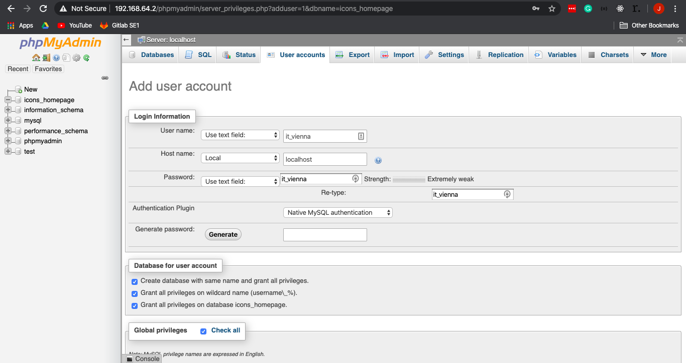

# icons - homepage

## How to set up WP for local development

#### Install xampp

https://www.apachefriends.org/de/index.html

#### Start server

Open Xampp<br>
Under _General_ press _start_

#### Clone git repo into htdocs/

Under _Volumes_ press on _Mount_ first and than _Explore_

Navigate to htdocs/

In this folder clone the github repo by executing the following command

```
git clone https://github.com/realantonw/icons-homepage.git
cd icons-homepage
git checkout -b develop
git pull origin develop
```

#### Create DB for homepage

In the browser of your choice go to

http://192.168.64.2/phpmyadmin/

> If you encounter an error check out this site <br>http://192.168.64.2/dashboard/docs/access-phpmyadmin-remotely.html

Under _Databases_ create a new db called <i>icons_homepage</i><br>
Make shure you select <i>Collation</i> (Top most option)<br>
Press Create<br>


#### Create user for db access

The icons_homepage db selected go to <i>Privileges</i> and click on <i>add new user acount</i> <br>
Fill in the following informations and click on Go.

> Make shure select all check boxes!



#### Finish installation

In the browser of your choice go to
http://192.168.64.2/icons-homepage/icons-homepage/wp-admin/install.php

Fill in the following information replacting your.email@icons.at with your email address and press install Wordpress.


You should now see something like this


Press Login

Using your email address and it_vienna as the password.

If it works. Give your self a high five for acomplishing something today :)


